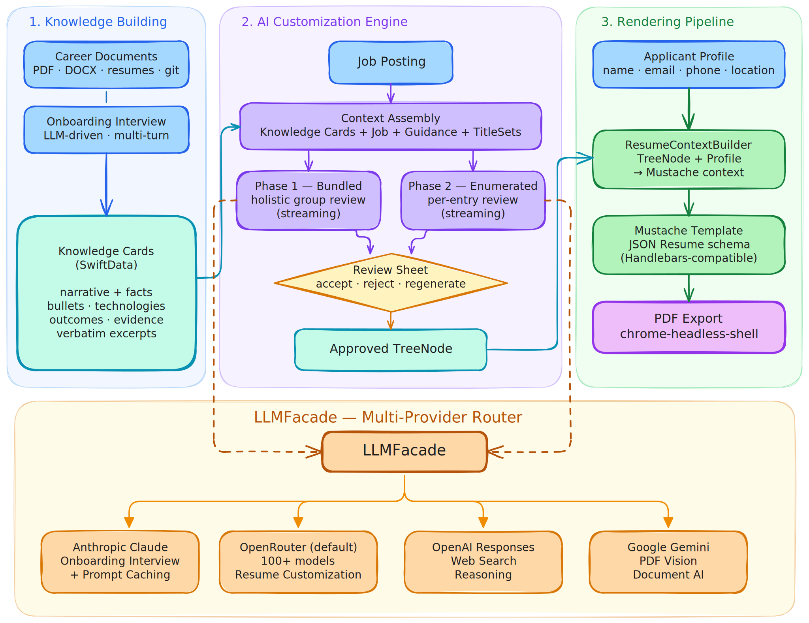
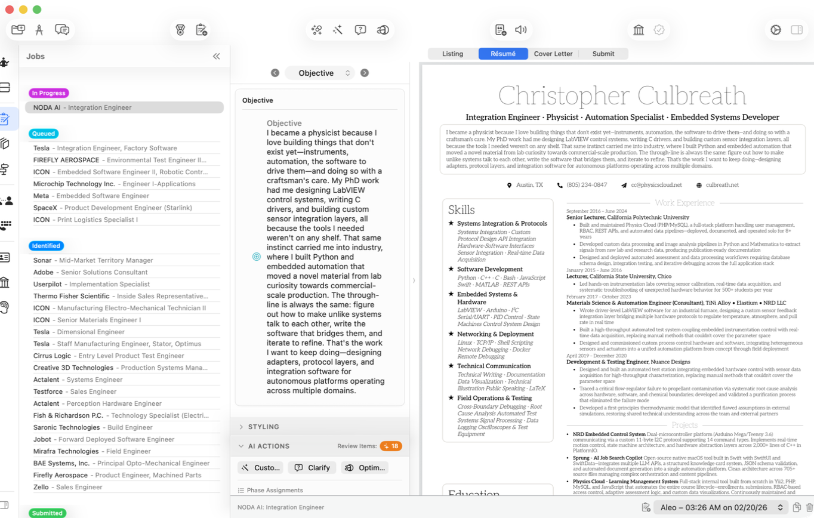
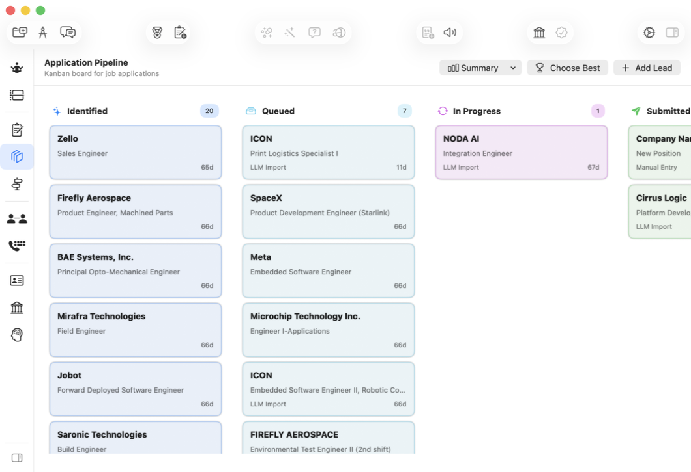
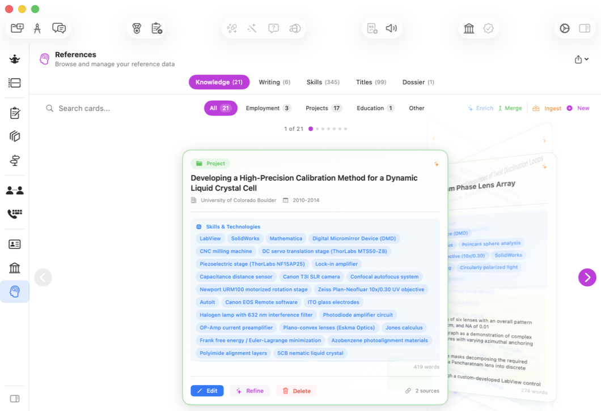
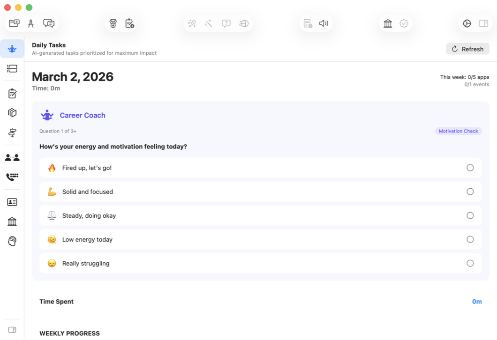

<p align="center">
  
</p>

<p align="center">
  <strong>A native macOS job search platform built around agentic AI and local data</strong>
</p>

<p align="center">
  <a href="https://www.apple.com/macos/sequoia"></a>
  <a href="https://swift.org"></a>
  <a href="https://developer.apple.com/xcode/swiftui/"></a>
  <a href="LICENSE"></a>
</p>

---

Sprung is a native macOS application I built to run my own job search after relocating to Austin. It captures career context through an agentic onboarding interview, then drives a multi-provider LLM pipeline to generate tailored resumes and cover letters from a structured knowledge base. Application tracking, networking, and source discovery live in the same app. All data stays local on the machine.

> **Status:** Currently using Sprung to run my own post-relocation job search. Open source under MIT — clone and build from source to try it.

## Architecture

A native SwiftUI app using `@Observable` stores with SwiftData persistence. Services are dependency-injected through `AppDependencies` — no singletons. `LLMFacade` is the single entry point for every AI call, routing automatically to the right provider based on the user-selected model.

<p align="center">
  
  <br><em>Knowledge Building → AI Customization Engine → Rendering Pipeline, with all LLM calls flowing through a multi-provider router</em>
</p>

Model selection per task is driven by user settings, so any of the four providers can be swapped or replaced without touching call sites:

| Provider | Default usage |
|----------|---------------|
| Anthropic Claude | Onboarding interview (multi-turn with tool calling) |
| Google Gemini | Document and artifact extraction |
| OpenRouter | Resume, cover letter, discovery, and general LLM tasks |
| OpenAI | Text-to-speech and structured web search |

API keys are stored in the macOS Keychain. Nothing leaves the machine except direct API calls to the configured providers. See [`docs/architecture.md`](docs/architecture.md) for a deeper component-level walkthrough.

## Technical Highlights

- **Agentic onboarding interview with tool calling.** The LLM drives multi-phase questioning, decides when to branch, and calls structured tools to extract Knowledge Cards rather than relying on post-hoc parsing.
- **`LLMFacade`: provider-agnostic interface** across Anthropic, Gemini, OpenRouter, and OpenAI. Per-task model routing is configured at runtime through user settings — no hard-coded provider assumptions in feature code.
- **Knowledge Cards** as a structured extraction layer that turns documents, Git repositories, and LinkedIn imports into a queryable career knowledge base. Downstream features compose against the cards rather than raw source material.
- **Mustache template engine + headless Chrome PDF rendering.** Resume templates are fully editable in-app with a live preview, and the same engine produces clean PDF output without round-tripping through Word or HTML editors.

## Screenshots

<p align="center">
  
  <br><em>Resume Editor — section editor with live PDF preview and AI revision</em>
</p>

<p align="center">
  
  <br><em>Application Pipeline — Kanban tracker with auto-parsed job postings</em>
</p>

<p align="center">
  
  <br><em>Knowledge Cards — structured career knowledge base extracted during onboarding</em>
</p>

<p align="center">
  
  <br><em>Discovery — job sources, contacts, and daily tasks</em>
</p>

## Features

### Onboarding Interview
A multi-phase, LLM-driven interview captures career history, skills, and writing style into a structured knowledge base. Documents, Git repositories, and LinkedIn content can be supplied as input; Sprung extracts Knowledge Cards, skill bank entries, and writing samples that power every downstream feature.

### Resume Editor
Split-pane workspace: structured section editor on the left, live PDF preview on the right. AI revision flows tailor a resume to a specific posting, ask clarifying questions when the source material is thin, and stream model reasoning to the UI. Reusable Experience Defaults seed new resumes from a stable baseline.

### Cover Letters
Generates job-aware cover letter drafts across multiple models in parallel, with side-by-side scoring and voting. An inspector view exposes sources and per-model feedback. Export to PDF, plain text, or stream through TTS preview.

### Job Applications
Kanban-style tracker spanning New through Offer and Rejected. Pasting a job URL auto-parses listings from LinkedIn, Indeed, Apple Careers, and similar sites. AI packet review evaluates a chosen resume and cover letter against the posting before submission.

### Discovery
A working surface for the operational side of a search: a contact CRM with relationship-state tracking, a job-source registry, and a daily task list scoped to active opportunities. Coaching sessions run against the same knowledge base used by the resume and cover-letter pipelines.

### Templates and Export
Mustache-based HTML/CSS resume templates with a built-in editor and live preview. Export to PDF (via headless Chrome), plain text, or structured JSON.

## Getting Started

**Prerequisites:** macOS 14.0+, Xcode 15+, API keys for Anthropic, OpenAI, OpenRouter, and Google Gemini.

```bash
git clone https://github.com/cculbreath/Sprung.git
cd Sprung
open Sprung.xcodeproj
```

1. Resolve packages if needed: **File → Packages → Resolve Package Versions**.
2. Build and run (`Cmd + R`).
3. Open **Settings** (`Cmd + ,`) to enter API keys and select models per task.

## Dependencies

| Package | Purpose |
|---------|---------|
| [SwiftOpenAI (fork)](https://github.com/cculbreath/SwiftOpenAI) | OpenAI and OpenRouter streaming support |
| [SwiftSoup](https://github.com/scinfu/SwiftSoup) | HTML parsing for job posting scraping |
| [GRMustache.swift](https://github.com/groue/GRMustache.swift) | Mustache templating for export |
| [SwiftyJSON](https://github.com/SwiftyJSON/SwiftyJSON) | Dynamic JSON handling for LLM interchange |
| [swift-collections](https://github.com/apple/swift-collections) | Ordered collections |
| [swift-chunked-audio-player](https://github.com/cculbreath/swift-chunked-audio-player) | Streaming TTS audio playback |

## Contributing

Contributions are welcome. See [CONTRIBUTING.md](CONTRIBUTING.md) for guidelines.

## License

MIT License. See [LICENSE](LICENSE).

---

*Built by [Christopher Culbreath](https://github.com/cculbreath)*
