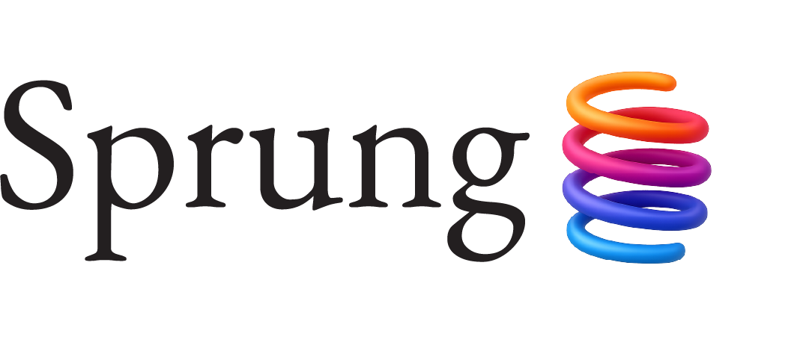

<p align="center">
  
</p>

<p align="center">
  <strong>AI-Powered Job Search Copilot for macOS</strong>
</p>

<p align="center">
  <a href="https://www.apple.com/macos/sequoia"></a>
  <a href="https://swift.org"></a>
  <a href="https://developer.apple.com/xcode/swiftui/"></a>
  <a href="LICENSE"></a>
</p>

---

Sprung is a native macOS application that streamlines every stage of a job search — from building a structured profile of your experience through an AI-guided interview, to generating tailored resumes and cover letters, tracking applications, and managing your search strategy. All data stays local on your Mac.

> **Status:** Actively developed. Clone and build from source to try it.

<!-- screenshots -->

## Features

### Onboarding Interview
A multi-phase AI interview captures your career history, skills, and writing style into a structured knowledge base. Upload documents, link Git repositories, and import LinkedIn content — Sprung extracts knowledge cards, skills, and writing samples that power everything downstream.

### Resume Editor
A split-pane workspace with a structured section editor on the left and live PDF preview on the right. AI revision flows let you customize resumes for specific roles with one click, ask clarifying questions, and watch the model's reasoning in real time. Experience defaults provide reusable baseline content that seeds new resumes.

### Cover Letters
Generate job-aware cover letter drafts across multiple models, compare them side-by-side with scoring and voting, then iterate with an inspector that shows sources and model feedback. Export to PDF or preview with streaming text-to-speech.

### Job Applications
A Kanban-style tracker with status groups from New through Offer and Rejected. Paste a job URL to auto-parse listings from LinkedIn, Indeed, Apple Careers, and other sites. Run AI-driven packet reviews that analyze your resume and cover letter against the posting.

### Discovery
AI-powered job search operations: daily task management, job source discovery, networking event pipeline, professional contact CRM with relationship tracking, coaching sessions, and weekly goal setting with progress reflections.

### Templates and Export
Mustache-based HTML/CSS resume templates with a built-in editor and live preview. Export to PDF (via headless Chrome), plain text, or structured JSON.

## Architecture

A native SwiftUI app using `@Observable` stores with SwiftData persistence. Services are dependency-injected through `AppDependencies` — no singletons. `LLMFacade` provides a unified interface across multiple AI providers, with model selection driven by user settings.

| Provider | Usage |
|----------|-------|
| Anthropic Claude | Onboarding interview (multi-turn with tool calling) |
| Google Gemini | Document and artifact extraction |
| OpenRouter | Resume, cover letter, discovery, and general LLM tasks |
| OpenAI | Text-to-speech and structured web search |

API keys are stored in the macOS Keychain.

## Getting Started

**Prerequisites:** macOS 14.0+, Xcode 15+, API keys for Anthropic, OpenAI, OpenRouter, and Google Gemini.

```bash
git clone https://github.com/cculbreath/Sprung.git
cd Sprung
open Sprung.xcodeproj
```

1. Resolve packages if needed: **File → Packages → Resolve Package Versions**.
2. Build and run (`Cmd + R`).
3. Open **Settings** (`Cmd + ,`) to enter API keys and select models.

## Dependencies

| Package | Purpose |
|---------|---------|
| [SwiftOpenAI (fork)](https://github.com/cculbreath/SwiftOpenAI) | OpenAI and OpenRouter streaming support |
| [SwiftSoup](https://github.com/scinfu/SwiftSoup) | HTML parsing for job posting scraping |
| [GRMustache.swift](https://github.com/groue/GRMustache.swift) | Mustache templating for export |
| [SwiftyJSON](https://github.com/SwiftyJSON/SwiftyJSON) | Dynamic JSON handling for LLM interchange |
| [swift-collections](https://github.com/apple/swift-collections) | Ordered collections |
| [swift-chunked-audio-player](https://github.com/cculbreath/swift-chunked-audio-player) | Streaming TTS audio playback |

## Contributing

Contributions are welcome. See [CONTRIBUTING.md](CONTRIBUTING.md) for guidelines.

## License

MIT License. See [LICENSE](LICENSE).

---

*Built by [Christopher Culbreath](https://github.com/cculbreath)*
