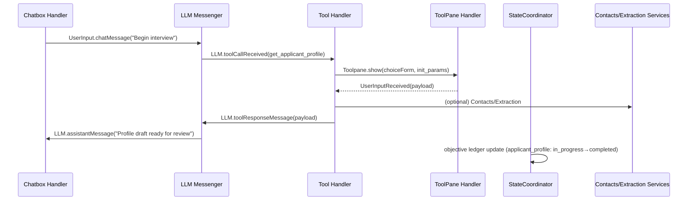

# Sprung Onboarding Module — Event‑Driven Architecture Spec (Draft)

**Author:** ChatGPT (with @cc)  
**Date:** November 03, 2025  
**Status:** Draft for review  
**Scope:** Onboarding interview module (macOS app) — coordinator, messaging, handlers, data contracts, and migration from current implementation.

> This spec translates the proposed sketch into a concrete, event‑driven architecture with explicit topics, data contracts, and migration guidance mapped to the existing codebase. Key references appear inline and at the end.

---

## 1) Context & Motivation

The current module centers on `InterviewOrchestrator`, `OnboardingInterviewCoordinator`, a callback lattice, and tool routing. The codebase is large (∼16k LOC across 88 Swift files) and exhibits tight coupling and duplicated state (see SourceIndex and the appended architecture analysis). 

Representative components and responsibilities today:

- **Orchestrator**: LLM streaming, tool calls, continuation tokens, checkpointing, and status fan‑out.   
- **Handlers**: Profile intake and validation flows; URL/contact/upload modes.   
- **Stores/ViewModels/Managers**: Wizard progress, transcripts, data persistence.   
- **Models**: Extraction progress, knowledge cards, artifacts, timeline.   
- **Phases**: Explicit phase scripts (Phase 1–3) with objective ledger guidance.   
- **Services**: Contacts import, document extraction, knowledge card agent.   
- **Tools**: Get/Extract/Timeline CRUD/Validation, etc.   
- **Utilities & Views**: Transcript formatting, upload storage, UI cards.  

**Motivation:** Replace callback tangles with a pub/sub backbone, centralize state, and formalize message contracts so LLM, UI, and services are plug‑replaceable without bidirectional dependencies.

---

## 2) Goals & Non‑Goals

### Goals
1. **Single Source of Truth for State** (actor): phase, objectives, allowed tools, and the “current system prompt.”  
2. **Event Bus (typed topics)** to decouple orchestration, UI handlers, and services.  
3. **Contract‑first design**: messages & payloads are schema‑controlled Swift types.  
4. **Deterministic phase transitions** with idempotent handlers and audited ledger.  
5. **First‑class streaming** for assistant text and reasoning summaries.  
6. **Backward‑compatible migration** over 1–2 sprints with feature flags.

### Non‑Goals
- Rewrite of view layer aesthetics.  
- Vendor lock‑in to a single LLM provider.  
- Changing tool capability semantics (Create/Update/Reorder/Delete/Validate).

---

## 3) High‑Level Architecture

```mermaid
flowchart TD
  subgraph Coordinators
    SC[StateCoordinator (actor)]
    EC[EventCoordinator]
  end

  subgraph LLM & IO
    N[NetworkRouter]
    LM[LLM Messenger]
    RH[LLM Reasoning Handler]
  end

  subgraph UI Handlers
    TB[ToolPane Handler]
    CB[Chatbox Handler]
    TH[Tool Handler]
    AH[Artifact Handler]
  end

  N -->|LLM.messageDelta/Received/ToolCall| LM
  N -->|LLM.reasoningDelta/Done| RH
  LM -->|LLM.user/dev/tool msgs| EC
  RH -->|LLM.reasoningSummary/Status| EC
  TB <--> EC
  CB <--> EC
  TH <--> EC
  AH <--> EC
  SC <--> EC
```

**Key tenets**  
- Coordinators own **state** and **events**, handlers are **pure reactors**.  
- All **state changes** flow through `StateCoordinator`.  
- LLM I/O surfaces as **events**, never direct calls into UI.  
- Tool execution happens in `Tool Handler`, not sprinkled in UI.

---

## 4) Components

### 4.1 StateCoordinator (actor) — “single source of truth”
**Responsibilities**
- Holds canonical **OnboardingState**: `currentSystemPrompt`, `allowedTools`, `currentPhase`, `nextPhase`, `objective ledger`, `lastResponseId`, etc.  
- Applies **phase scripts** and emits transition events. (Phases map to current enums: `.phase1CoreFacts`, `.phase2DeepDive`, `.phase3WritingCorpus`, `.complete`.)    
- Persists lightweight checkpoints (existing `Checkpoints`). 

**Subscriptions**
- `State.set(..)` partial updates  
- `LLM.userMessageSent`, `LLM.sentToolResponseMessage` (to track ids)  
- `Objective.ledger.update`

**Publications**
- `State.snapshot(updated_keys)`  
- `State.allowedTools()`  
- `Phase.transition.requested` → `Phase.transition.applied`  
- `Objective.status.changed`

**State Variables**
- `currentSystemPrompt: String`  
- `allowedTools: Set<ToolName>` (derived from phase/tool map)   
- `currentPhase: InterviewPhase` / `nextPhase: InterviewPhase?`  
- Objective ledger snapshot

---

### 4.2 EventCoordinator — "pub/sub backbone"
**Responsibilities**
- Topic registry, subscription management, async fan‑out.
- Metrics on queue depth, handler latency.

**Implementation:** AsyncStream-based architecture (2025-11-03 decision)

**API**
```swift
actor EventCoordinator {
  // Subscribe to specific topic
  func stream(topic: EventTopic) -> AsyncStream<OnboardingEvent>

  // Subscribe to all events (debugging/compatibility)
  func streamAll() -> AsyncStream<OnboardingEvent>

  // Publish event (automatically routed to topic)
  func publish(_ event: OnboardingEvent) async

  // Metrics
  func getMetrics() -> EventMetrics
}
```

**Core Topics (EventTopic enum)**
- `llm`, `toolpane`, `artifact`, `userInput`, `state`, `phase`, `objective`, `tool`, `timeline`, `processing`

**Architecture Benefits:**
- Natural Swift concurrency: `for await event in stream(topic: .llm)`
- Built-in backpressure via `bufferingNewest(50)` per topic
- Topic-based filtering at source (performance)
- Per-topic metrics (publishedCount, queueDepth, lastPublishTime)

---

### 4.3 LLM Messenger
**Subscribes**
- `LLM.sendUserMessage(payload)`  
- `LLM.sendDeveloperMessage(payload)`  
- `LLM.toolResponseMessage(payload)`  
- `UserInput.chatMessage`  
- `State.allowedTools()`

**Publishes**
- `LLM.userMessageSent(payload)`  
- `LLM.developerMessageSent(payload)`  
- `LLM.sentToolResponseMessage(payload)`  
- `LLM.status(busy|idle|error)`

This replaces direct callback spaghetti from `InterviewOrchestrator` with event emission (streaming and finalization retained). 

---

### 4.4 NetworkRouter
**Responsibilities**
- Monitor/route inbound SSE/WebSocket deltas to events.

**Publishes**
- `LLM.messageDelta`, `LLM.messageReceived`, `LLM.toolCallReceived`, `LLM.reasoningDelta`, `LLM.reasoningDone`, `LLM.error` (typo fixed from “reasoningdDone”).

---

### 4.5 LLM Reasoning Handler
**Subscribes**
- `LLM.reasoningDelta`, `LLM.reasoningDone`

**Publishes**
- `LLM.reasoningSummary(payload)` (throttled)  
- `LLM.reasoningStatus(incoming|none)`

UI uses existing “reasoning summary” constructs. 

---

### 4.6 Tool Handler
**Subscribes**
- `LLM.toolCallReceived`

**Responsibilities**
- Validates tool name against `State.allowedTools`.  
- Executes tools via Services (e.g., DocumentExtractionService), manages continuation tokens.  

**Publishes**
- `Tool.result(immediate|waiting|error)`  
- `LLM.toolResponseMessage(payload)`  
- `State.allowedTools()` (when phase/tool set changes)

**Example tool**: `get_user_choice()` (choice card descriptor) → `Toolpane.cards.choiceForm.show` (see ToolPane section).

---

### 4.7 ToolPane Handler
**Responsibilities**
- Card/spinner visibility & lifecycle, separate from business logic.

**Subscribes**
- `Toolpane.show(card, init_params)`  
- `Toolpane.hide(card)`  
- `LLM.status`

**Publishes**
- `Toolpane.showing(card|none)`

---

### 4.8 Artifact Handler
**Responsibilities**
- Manages `Artifact.new(payload)` and retrieval `Artifact.get(id)`, delegates to stores & services.  
- Directly invokes extraction loop (Gemini/OpenRouter path stays in DocumentExtractionService). 

**Subscribes**
- `Artifact.get(id)`  
- `Artifact.new(payload)`

**Publishes**
- `Artifact.added`  
- `Artifact.updated`

---

### 4.9 Chatbox Handler
**Responsibilities**
- Render chat messages, reasoning summaries, busy glow.  
- Emits user input events.

**Subscribes**
- `LLM.status`  
- `LLM.assistantMessage(payload)`  
- `LLM.ReasoningSummary(payload)`  
- `LLM.reasoningStatus(incoming|none)`  
- `LLM.userMessageSent(payload)`  
- `LLM.error`

**Publishes**
- `UserInput.chatMessage`

Uses existing transcript formatter and stores.  

---

## 5) Data Contracts

### 5.1 `MessagePayload`
Fields (union by message type):
- `prompt: String`  
- `messageType: enum {user, assistant, system, tool_result}`  
- `previousResponseId: String?`  
- `availableTools: [String]`  
- `use_tool: Bool?`  
- `scratchpad: String?`  
- `instructions (system prompt): String?`  
- **Metadata**: `{ currentObjective?: String, objectiveStatus?: String, availableTools?: [String] }`

Backed by existing models (`OnboardingMessage`, transcript formatting).  

### 5.2 `OnboardingPhase`
```swift
struct OnboardingPhaseSpec {
  let id: InterviewPhase        // existing enum
  let promptPack: String
  let nextPhase: InterviewPhase?
  let objectiveCriteria: [String]   // ledger keys
  let enabledTools: [String]
}
```
Maps to current `allowedToolsMap` and PhaseScripts.  

### 5.3 `ToolPaneCardDescriptor`
```swift
struct ToolPaneCardDescriptor {
  let cardType: String              // e.g., "choiceForm", "uploadForm"
  let title: String
  let initParams: [String: AnyCodable]
  let onsubmitEventsForChoice: [EventName]
  let onSubmitEventsAlways: [EventName]
  let deliveryPayload: JSON?        // attached to follow-up event
}
```
Cards publish `UserInputReceived(payload)` then `Toolpane.hide(card)`.

---

## 6) Event Topics (initial)

- `LLM.sendUserMessage`, `LLM.sendDeveloperMessage`, `LLM.toolResponseMessage`  
- `LLM.userMessageSent`, `LLM.developerMessageSent`, `LLM.sentToolResponseMessage`  
- `LLM.messageDelta`, `LLM.messageReceived`, `LLM.toolCallReceived`, `LLM.reasoningDelta`, `LLM.reasoningDone`, `LLM.status`, `LLM.error`  
- `Toolpane.show`, `Toolpane.hide`, `Toolpane.showing`  
- `UserInput.chatMessage`, `UserInput.received`  
- `Artifact.get`, `Artifact.new`, `Artifact.added`, `Artifact.updated`  
- `State.set(partial)`, `State.snapshot`, `State.allowedTools`  
- `Phase.transition.requested`, `Phase.transition.applied`  
- `Objective.status.changed`

Naming matches the sketch and the current tool/phase terminology.  

---

## 7) Core Sequences

### 7.1 Applicant Profile (Phase 1)

Grounded in PhaseOneScript and tool contracts.  

### 7.2 Resume Timeline Extraction
- `get_user_upload` → `extract_document` (Gemini enrichment fallback to raw text), publish `ExtractionProgress` events to UI; validation step opens review card; persist via `persist_data`.   

### 7.3 Reasoning Summaries
- `NetworkRouter` emits deltas; `LLM Reasoning Handler` aggregates and publishes summaries used by Chat transcript model. 

---

## 8) State Model & Phase Policy

- **Allowed tools per phase** (port from `InterviewOrchestrator.allowedToolsMap`):  
  P1: `get_user_option`, `get_applicant_profile`, `get_user_upload`, `get_macos_contact_card`, `extract_document`, timeline CRUD, `submit_for_validation`, `persist_data`, `set_objective_status`, `next_phase`.  
  P2: adds `generate_knowledge_card`.  
  P3: same as P1 sans timeline CRUD if frozen; coordinator may still allow edits. 

- **Objective Ledger**: Idempotent updates via `Objective.status.changed` events, mirrored in UI wizard progress. 

- **Checkpoints**: Continue using `InterviewCheckpoint` snapshots limited to N=8 for fast restore. 

---

## 9) Data Persistence & Artifacts

- Persist app‑local JSON payloads via `InterviewDataStore` and artifact records via `OnboardingArtifactStore`.  
- Uploads staged under `OnboardingUploadStorage`.  

- `DocumentExtractionService` remains vendor‑agnostic and reports quality/confidence & issues; Tool wraps service and shapes response.  

---

## 10) Error Handling & Retries

- **Tool errors** → `Tool.result(error)`; LM turns them into assistant messages tagged with `LLM.error` and actionable hints.  
- **LLM API errors** normalized via `APIError.displayDescription`.   
- **Extraction failures** map to user‑facing strings from service enum. 

---

## 11) Telemetry & UX Signals

- Event bus counters: per‑topic throughput, lag, handler latency.  
- UI: Busy glow driven solely by `LLM.status`; progress rows via `ExtractionProgress` stream.  

---

## 12) Section Omitted
---

## 13) Risks & Mitigations

- **Event storming / lost updates** → typed topics, bounded queues, idempotent reducers in `StateCoordinator`.  
- **Tool availability drift** → validate against `allowedTools` on every tool call; emit `LLM.error` if disallowed (prevents silent misbehavior).   
- **UI regressions** → begin with adapters; preserve existing cards and wizards. 

---

## 14) Open Questions

- Do we expose a small scripting DSL for phase scripts (beyond current hard‑coded structs)?   
- Should `KnowledgeCardAgent` run out‑of‑process to isolate failures? 

---

## 15) References

- **Core**: Checkpoints, Orchestrator, Session, Coordinator, Services & Tool Router.   
- **Handlers**: Profile intake/validation modes.   
- **Stores/ViewModels/Managers**: Wizard, transcripts, data store, VM.   
- **Models**: ExtractionProgress, KnowledgeCardDraft, Artifacts, Placeholders.   
- **Phases**: PhaseOneScript & registry.   
- **Services**: Contacts, Extraction, Knowledge card agent.   
- **Index & Report**: SourceIndex with file map and appended code status report.   
- **Tools**: Implementations (Extract/Timeline CRUD/Validation/etc.).   
- **Utilities**: Transcript formatting, upload storage, adapters.   
- **Views**: Intake/Review/Chat and progress components. 

---

## 16) Appendix A — Minimal Type Stubs

```swift
enum Topic: String { case LLM, Toolpane, Artifact, UserInput, State, Phase, Objective }

protocol Event {
  associatedtype Topic
  var topic: Topic { get }
  var name: String { get }
  var payload: Any { get }
}

actor StateCoordinator {
  func apply(_ e: Event) { /* reduce into state & publish snapshot */ }
  func snapshot() -> OnboardingState { /* ... */ }
}

struct ToolPaneCardDescriptor { /* see §5.3 */ }
```
